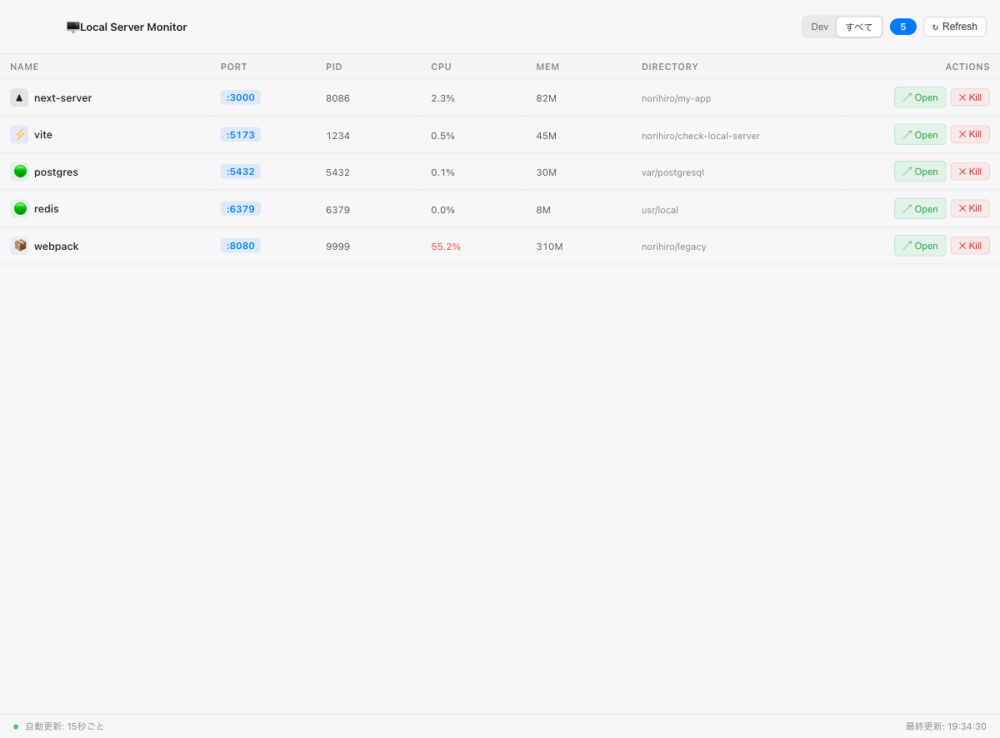
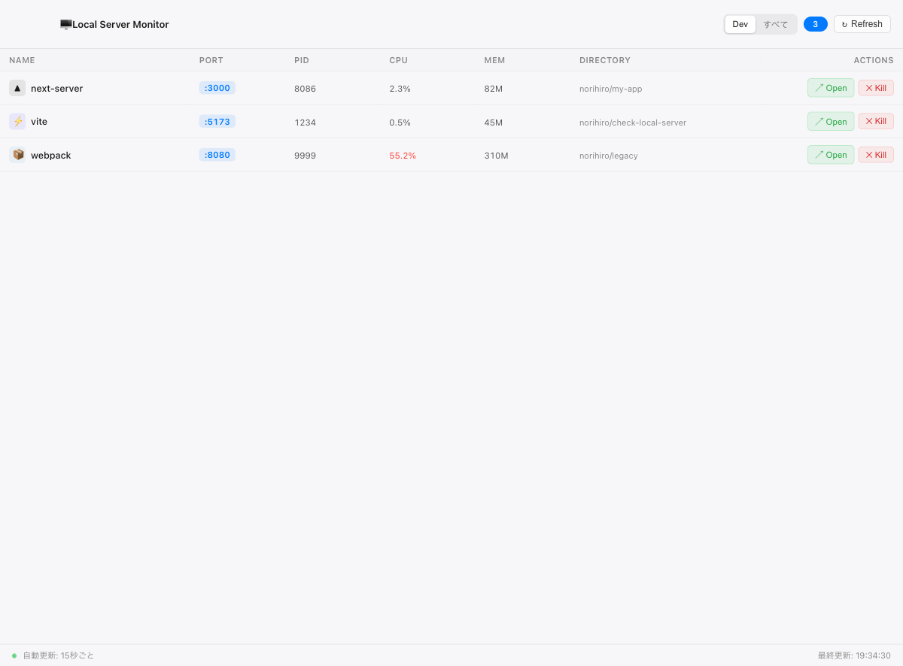

# Local Server Monitor

ローカルで起動中のサーバープロセスを一覧表示・管理する macOS 向け Electron アプリ。



## 機能

- **プロセス自動検出** — `lsof` + `ps` を使って LISTEN 中の TCP ポートを持つプロセスをスキャン
- **Dev / すべて フィルター** — `node`, `vite`, `webpack`, `next` などの開発ツールのみに絞り込む Dev モードと、DB・インフラも含む全表示モードを切り替え可能
- **リソース表示** — ポート番号、PID、CPU 使用率、メモリ (RSS)、作業ディレクトリを一覧表示
- **Open** — ボタン1つでブラウザを開いてサーバーにアクセス
- **Kill** — SIGTERM → 必要に応じて SIGKILL でプロセスを終了
- **自動更新** — 15 秒ごとにバックグラウンドで自動スキャン

## スクリーンショット

| All Mode | Dev Mode |
|----------|----------|
|  |  |

## 技術スタック

| レイヤー | 使用技術 |
|----------|----------|
| フレームワーク | Electron 33 |
| UI | Lit 3 (Web Components) |
| ビルド | electron-vite + Vite 6 |
| 言語 | TypeScript 5 |
| パッケージング | electron-builder (dmg, arm64/x64) |

## 開発

```bash
npm install
npm run dev
```

## ビルド

```bash
# プロダクションビルド
npm run build

# dmg パッケージング
npm run package
```

成果物は `dist/` に出力されます。

## アーキテクチャ

```
src/
├── main/
│   ├── index.ts            # Electron メインプロセス・IPC ハンドラー
│   └── process-scanner.ts  # lsof/ps によるプロセススキャン・Kill
├── preload/
│   └── index.ts            # contextBridge による IPC 公開
├── renderer/
│   └── src/
│       ├── app-root.ts     # ルートコンポーネント（フィルター・自動更新）
│       ├── server-list.ts  # サーバー一覧テーブル
│       └── server-row.ts   # 各行コンポーネント
└── shared/
    └── types.ts            # 共通型定義 (ServerProcess)
```

## 動作要件

- macOS（`lsof` / `ps` コマンドに依存）
- Node.js 18+
